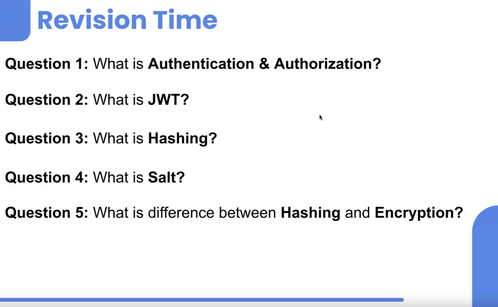

># Revision



># IMP Dependency
- nodemon
- express
- mongoose
- dotenv
- cors
- bcrypt
- jsonwebtoken

># Important Dependencies

>## 1. Nodemon
**Purpose:** Automatically restarts the node application when file changes in the directory are detected.  
**Use Case:** During development, when you make changes to your code, you don't want to manually stop and start the server each time. Nodemon watches for changes and restarts the server for you, making development more efficient.

>## 2. Express
**Purpose:** A fast, unopinionated, minimalist web framework for Node.js.  
**Use Case:** It simplifies the process of creating server-side web applications and APIs. With Express, you can set up routes, handle HTTP requests and responses, manage middleware, and more with ease.

>## 3. Mongoose
**Purpose:** An Object Data Modeling (ODM) library for MongoDB and Node.js.  
**Use Case:** Mongoose provides a straightforward, schema-based solution to model your application data. It includes built-in type casting, validation, query building, business logic hooks, and more, making it easier to work with MongoDB in a structured and efficient way.

>## 4. Dotenv
**Purpose:** Loads environment variables from a `.env` file into `process.env`.  
**Use Case:** Managing environment variables in a separate `.env` file is a best practice for keeping sensitive information such as API keys, database URIs, and other configuration details out of your source code. Dotenv makes it easy to load these variables into your application.

>## 5. Understanding CORS (Cross-Origin Resource Sharing)
**Purpose:** Middleware to enable Cross-Origin Resource Sharing (CORS).  
**Use Case:** When building web applications, you might need to make requests from a different domain (or port). CORS is a security feature implemented by browsers to prevent cross-origin requests. The `cors` middleware allows you to configure and enable CORS in your Node.js application.


## What is CORS?

CORS stands for **Cross-Origin Resource Sharing**. It's a security feature implemented by web browsers to control how web pages from one origin (like `localhost:3000`) can interact with resources from another origin (like `localhost:4000`).

- **Origin** refers to a combination of a domain, protocol, and port. For example, `http://localhost:3000` and `http://localhost:4000` are considered different origins even though they are on the same domain and protocol, because their ports are different.

## Why is CORS Necessary?

In a typical web application setup, you might have:
- A **frontend** (client-side) application, often built with frameworks like React, Angular, etc., which runs on one server (e.g., `localhost:3000` during development).
- A **backend** (server-side) application, which handles requests, communicates with databases, and returns data. This backend might run on another server or port (e.g., `localhost:4000`).

When the frontend tries to make an HTTP request (like a GET or POST request) to the backend, if the request is being made to a different origin, the browser will block it by default due to security concerns. This is where CORS comes in.

## How CORS Works

To allow the frontend to communicate with the backend despite the different origins, the backend needs to explicitly allow this. This is done by configuring CORS.

## The Code Example

### Setup:
- **Backend Running on Port 4000:** Your backend server is running on `http://localhost:4000`.
- **Frontend Running on Port 3000:** Your React frontend is running on `http://localhost:3000`.

These two applications are on different origins because of their different ports, even though they are both on `localhost`.

## CORS Configuration Examples

### 1. Specific Origin Allowed

```javascript
cors({ origin: 'https://notes.app.netlify.com' });
```

This configuration allows only requests from the origin `https://notes.app.netlify.com` to be accepted by your server. Any other origin attempting to make a request will be blocked by the server due to the CORS policy.

### 2. Mismatched Comment Example

```javascript
cors({ origin: 'https://notes.app.netlify.com' }); // only https://notes.app.netlify.com can request
```

**Note:** The comment should correctly reflect the specified origin. In this case, it means only `https://notes.app.netlify.com` can make requests to the backend, not `localhost:3000`.

### 3. Allowing Any Origin (Wildcard)

```javascript
cors({ origin: '*' });
```

This configuration allows requests from any origin. The `*` wildcard indicates that all origins are permitted to make requests to the server. 

**Important:** While this may be useful in development or certain public APIs, it's generally not recommended for production environments as it opens up your server to potential security risks.

## Summary

- CORS enables you to define which client or frontend can interact with your backend.
- Specifying a particular origin restricts access to only that origin.
- Using a wildcard (`'*'`) allows any origin to make requests but is less secure.


>## 6. Bcrypt
**Purpose:** A library to help you hash passwords.  
**Use Case:** When storing user passwords, it's essential to hash them before saving to the database to enhance security. Bcrypt is a popular choice for password hashing because it incorporates salt to protect against rainbow table attacks and ensures the hash is computationally intensive to deter brute-force attacks.

>## 7. Jsonwebtoken (JWT)
**Purpose:** A library to create and verify JSON Web Tokens.  
**Use Case:** JWTs are a popular method for implementing authentication and authorization. They allow you to securely transmit information between parties as a JSON object. When a user logs in, a JWT is generated and sent to the client, which can then be used to access protected routes and resources.

>## How They Work Together

1. **Express** provides the web server framework for your application.
2. **Nodemon** helps you by automatically restarting the server during development.
3. **Mongoose** connects your application to a MongoDB database, allowing you to define schemas and interact with your data.
4. **Dotenv** loads environment variables that contain sensitive information or configuration details.
5. **Cors** enables your application to handle requests from different origins.
6. **Bcrypt** hashes user passwords before storing them in the database, enhancing security.
7. **Jsonwebtoken** handles authentication by generating and verifying tokens, allowing secure access to protected routes.

These dependencies are commonly used together to build secure, efficient, and maintainable web applications with Node.js.
